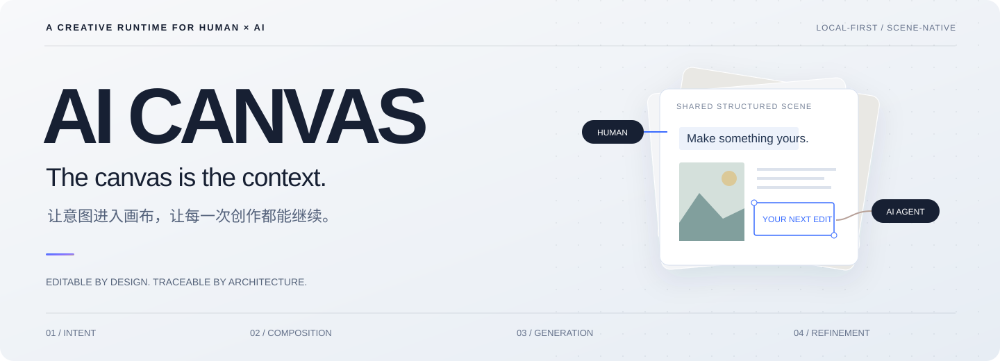
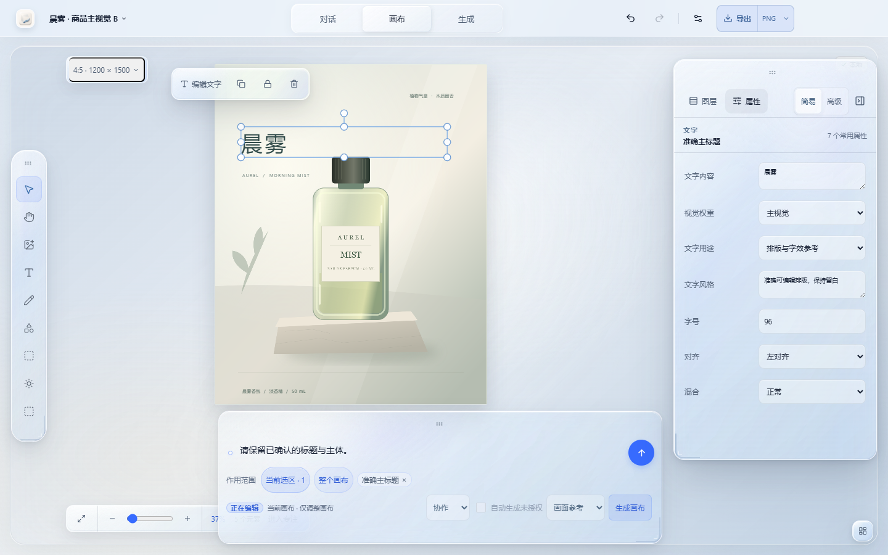
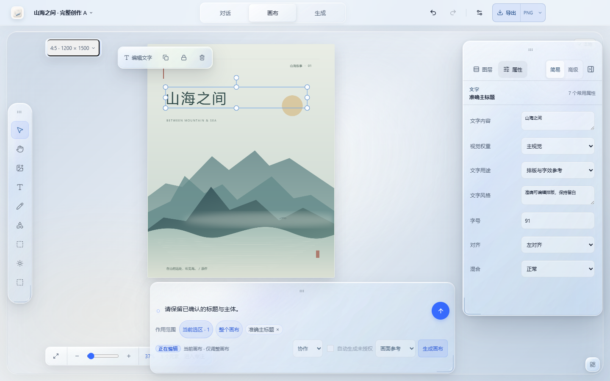
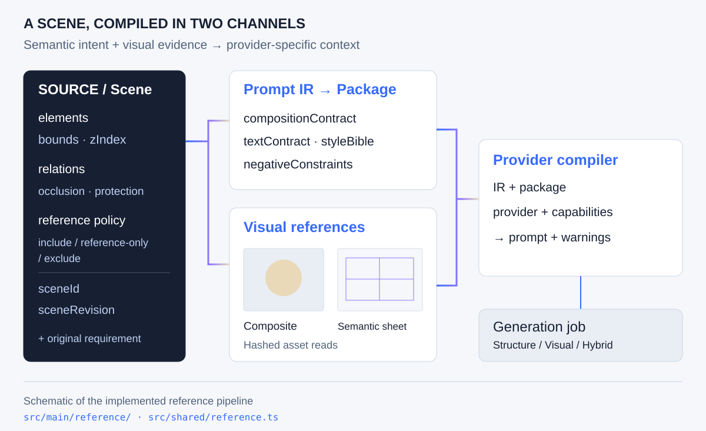
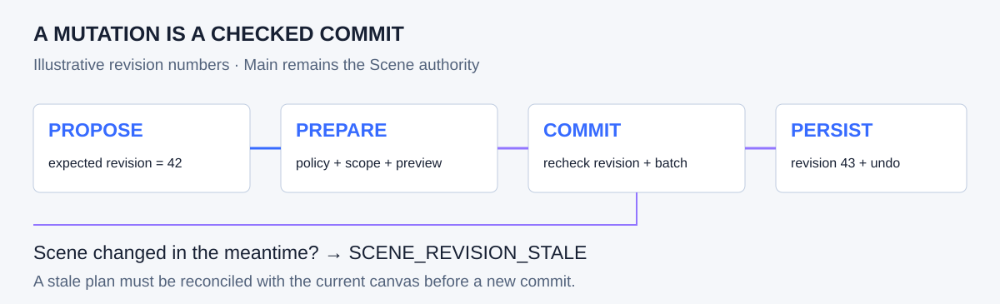

<div align="center">



**让意图成为结构，让每一次生成都能继续创作。**

A local-first visual instrument with a scene-native Agent.

<kbd>TypeScript</kbd> &nbsp; <kbd>Electron</kbd> &nbsp; <kbd>React</kbd> &nbsp; <kbd>Konva</kbd> &nbsp; <kbd>SQLite</kbd>

[创作现场](#创作现场) · [参考编译](#参考编译) · [执行契约](#执行契约) · [生成运行时](#生成运行时) · [开始构建](#开始构建) · [创作者](#创作者)

</div>

## 创作现场

“保留主体，把标题收小一点。沿用这个构图，再试一版清晨的光。”

一句话同时包含保留、排版、参考与生成。AI Canvas 将这些决定落在同一份可编辑的 **Scene** 中：Agent 与鼠标操作同一组对象，参考编译器组织生成上下文，结果回到画布成为下一次创作的起点。



<sub>实际应用截图，来自 2026-09-08 离线验证；画面使用自制合成测试素材，展示编辑交互，不代表真实模型画质。下方图解为架构示意。</sub>

| 对话 — 表达意图 | 画布 — 精确控制 | 生成 — 探索方向 |
| :--- | :--- | :--- |
| 说明目标、补充参考、检查实际动作 | 排版、移动、缩放、分组、裁剪 | 配置请求、比较结果、延续分支 |
| Agent 修改结构化对象 | 人工接管同一份 Scene | 成图重新进入编辑循环 |

工具栏、检查器与创作输入采用 **Glass Islands**：浮动、停靠、缩放、收起，将空间留给作品。文字与形状保持可编辑；模型返回的成图以图片元素继续参与创作。

<details>
<summary><strong>另一种创作现场：封面与独立文字排版</strong></summary>



同批离线验证截图。调整标题不需要重新生成整张底图。

</details>

## 参考编译

### The scene is a source language.

画布同时承载几何、语义与视觉证据。一次生成需要知道主体在哪里、哪些元素互相遮挡、哪些文字必须准确，以及哪些辅助对象不应该出现在成图里。

**Reference Compiler 将这些信息编译为语义包与视觉参考，再按 Provider 能力组织请求上下文。**



| 中间表示 | 保留的信息 | 对创作的意义 |
| :--- | :--- | :--- |
| **Prompt IR** | bounds、zIndex、relations、occlusions、protectedElementIds | 布局、层次、遮挡与保护意图可以被继续处理 |
| **Prompt Package** | compositionContract、textContract、styleBible、negativeConstraints | 将构图、文字、风格与禁止项分别表达 |
| **Reference Manifest** | appearance-composite、semantic-sheet、source-image、sketch-underlay、mask | 区分参考素材的用途，并保留来源关系 |
| **Provider Compiled Prompt** | prompt、negativePrompt、referenceMode、warnings | 在具体服务能力下形成提示内容与限制说明 |

例如，`reference-only` 元素可成为语义引导；隐藏、排除、蒙版与分组元素的 presentation 可为 `omitted`。它们依然可以携带结构或保护信息，但不应被直接画成编辑器控件。

<details>
<summary><strong>代码切面：Scene 如何投影为 Prompt IR</strong></summary>

下面摘取 `compilePromptIr` 中的元素映射；省略了其他字段。这是内部编译实现，不是对外 SDK 示例。

```typescript
elements: scene.elements.map((element) => ({
  id: element.id,
  type: element.type,
  // … name, description, semanticRole, provenance
  referencePolicy: element.referencePolicy,
  presentation: presentationFor(element),
  zIndex: element.zIndex,
  opacity: element.opacity,
  blendMode: resolveBlendMode(element),
  bounds: { ...element.transform },
  attributes: attributesFor(element)
}))
```

编译结果同时携带 `sceneId` 与 `sceneRevision`。参考素材读取经过内容哈希核对；编译器输出合成参考、语义图、Prompt IR、Prompt Package、Provider prompt 与 warnings。

**阅读实现：** [Reference Compiler](src/main/reference/reference-compiler.ts) · [Prompt IR](src/main/reference/prompt-ir.ts) · [Reference Contracts](src/shared/reference.ts) · [编译集成测试](tests/integration/reference-compiler.test.ts)

</details>

## 执行契约

### A suggestion becomes a checked mutation.

Agent 的修改先表达为有作用域的命令，再经过策略、锁定和版本校验。预览保存操作批次、结果摘要与反向补丁；提交时，Main 再次核对权威 Scene 与执行结果。



| 校验点 | 实现约束 |
| :--- | :--- |
| **版本** | `expectedSceneRevision` 必须与当前权威 Scene 一致；预览后发生人工编辑，提交也会再次检查 |
| **作用域与权限** | scope、元素锁定、保护与工具策略参与预览许可判断 |
| **执行身份** | 幂等键绑定工具参数；提交令牌绑定会话、有效期与 prepared 状态 |
| **结果一致性** | 对照预览核对 batch、patches、inversePatches 与 Scene digest |
| **可撤销记录** | 本地已提交操作保留批次与反向补丁；外部请求及费用不随画布撤销而消失 |

这条链路解决一个具体冲突：**模型规划之后，用户可能已经把画布改了。** 旧计划不能假装这些修改不存在。

**阅读实现：** [Agent 执行器](src/main/agent/agent-tool-executor-shadow.ts) · [Scene Service](src/main/scene/scene-service.ts) · [命令执行](src/domain/commands/apply-command.ts) · [执行契约测试](tests/integration/agent-tool-executor-shadow.test.ts)

## 生成运行时

### A network timeout is not proof of non-submission.

生成任务保留请求身份、提交状态、结果与来源关联。队列必须区分“确定未发送”和“可能已经发出”，因为一次普通的重试可能变成第二笔付费请求。

```text
                        request outcome
                               │
              ┌────────────────┴─────────────────┐
              ▼                                  ▼
     confirmed not_sent                 possibly submitted
              │                         or externalTaskId exists
              ▼                                  │
     retry safety checks                         ▼
              │                               NO_REPOST
              ▼                                  │
     prepare a new attempt              reconcile the original job
```

对于非 mock Provider，如果任务已有外部 ID、提交状态不是 `not_sent`，或请求身份不可用，重试保护会拒绝重新 POST。无法核对原请求配置、凭据版本或累计预算时，外部执行进入暂停处理路径。

请求数、图片数与费用上限由执行策略约束；恢复能力仍取决于具体 Provider 协议。UI 呈现实际动作、范围、结果与恢复状态。

**阅读实现：** [Generation Queue](src/main/generation/generation-queue.ts) · [Workflow Coordinator](src/main/generation/generation-workflow-coordinator.ts) · [Generation Policy](src/main/agent/generation-policy.ts) · [队列集成测试](tests/integration/generation-queue.test.ts)

## 运行边界

```text
  RENDERER       Conversation ↔ Canvas ↔ Generate
                              │
  PRELOAD               typed, validated IPC
                              │
  MAIN           ┌────────────┼─────────────────────┐
                 │            │                     │
           Agent Runtime  Scene Authority      Generation Runtime
           context/policy revision/commands     identity/budget
                 │            │                     │
                 │      Reference Compiler ─────────┘
                 │            │                     │
           configured LLM     │              configured image API
                              │
  LOCAL STORAGE          SQLite + asset files
```

Main 负责 Scene、持久化、凭据与外部请求。Renderer 通过 Preload 与窄 IPC 接口操作，窗口开启 sandbox、context isolation 并关闭 Node integration。在线模型使用保存并验证过的 Provider 配置；本地优先指项目存储与控制边界，在线推理仍会发送所需提示词与参考内容。

Agent 上下文围绕 thread、turn、任务关系与执行状态组织，连接近期对话、项目记忆、Directive 与当前 Scene。对话、画布与生成是同一个项目的三个工作焦点。

**阅读实现：** [窗口隔离](src/main/window.ts) · [IPC 注册](src/main/ipc/register-desktop-ipc.ts) · [持久化 Agent Loop](src/main/agent/persistent-agent-loop.ts) · [Context Builder](src/main/agent/context-builder.ts) · [数据库](src/main/storage/database.ts)

<details>
<summary><strong>工程地图与技术栈</strong></summary>

| 目录 | 职责 | 主要技术 |
| :--- | :--- | :--- |
| `src/domain/` | Scene、命令与领域规则 | TypeScript · Zod · Immer |
| `src/main/` | Agent、参考编译、生成、存储 | Electron · Sharp · SQLite · Kysely |
| `src/preload/` | 桌面 API 桥接 | Electron contextBridge |
| `src/renderer/` | 创作界面、画布与交互状态 | React · Konva · Zustand |
| `src/shared/` | 跨进程类型与运行时契约 | TypeScript · Zod |
| `tests/` | 单元、集成与桌面行为验证 | Vitest · Testing Library · Playwright |

</details>

## 开始构建

主要开发与打包平台为 **Windows x64**。准备 Node.js **≥22** 与 pnpm **11.9.0**：

```powershell
pnpm install --frozen-lockfile
pnpm dev
```

新建项目后，在设置中分别配置语言模型与图片模型的协议、服务地址、模型标识及 API Key，并设置请求、图片与费用上限。本地画布可以先开始使用；在线能力使用你自己的模型服务与额度。

<details>
<summary><strong>Provider 适配范围</strong></summary>

| 能力 | 已有协议适配路径 |
| :--- | :--- |
| 语言模型 | Ark Responses · OpenAI Responses · OpenAI Chat Completions |
| 图片模型 | Ark Seedream · OpenAI Images · 任务式图片协议 |

协议名称相同不保证各服务实现都兼容。参考图、蒙版、编辑和流式输出取决于具体服务能力及实际响应。配置定义见 [Provider Contracts](src/shared/provider-settings.ts)。

</details>

```powershell
pnpm typecheck
pnpm lint
pnpm test
pnpm test:integration
pnpm build
```

桌面交互：`pnpm test:e2e`。Windows 安装包与便携版：`pnpm package:win`。

首次安装可能下载 Electron 并构建原生模块。桌面测试需要图形环境，部分专项用例需要额外合成测试数据。自动验证使用离线替身，不调用真实收费 Provider；macOS / Linux 尚未作为已验证交付平台。

## 创作的单位，是持续演进的作品

我们希望 AI 能理解作品的连续性：哪些已确定，哪些还在探索，哪些需要保留，以及下一步为什么要改。

**意图有结构。自动化可接管。作品有记忆。工具有分寸。**

这些原则指向一件可以每天使用的视觉创作仪器。当前仓库是持续演进中的产品实现；任意成图自动拆层、真实模型效果保证与跨平台全面验收，都不属于当前交付承诺。

## 创作者

| 创作者 | 贡献 |
| :--- | :--- |
| **BiranSama** | 产品方向、设计判断与最终决策 |
| **Codex · OpenAI** | AI 辅助代码实现、工程分析与文档设计 |

这个项目由人与 AI 协作推进：人决定值得做什么，AI 参与把它实现出来，再一起审视结果。以上署名说明协作工具与贡献角色，不代表 OpenAI 官方出品或背书。

欢迎围绕 AI 原生编辑器、视觉语义编译与可撤销 Agent 执行交流。反馈请提供脱敏截图与最小复现。当前尚未配置开源许可证，复用授权范围待明确。

---

<div align="center">

**The canvas is the context.**

Built with intention. Shaped through collaboration.

</div>
