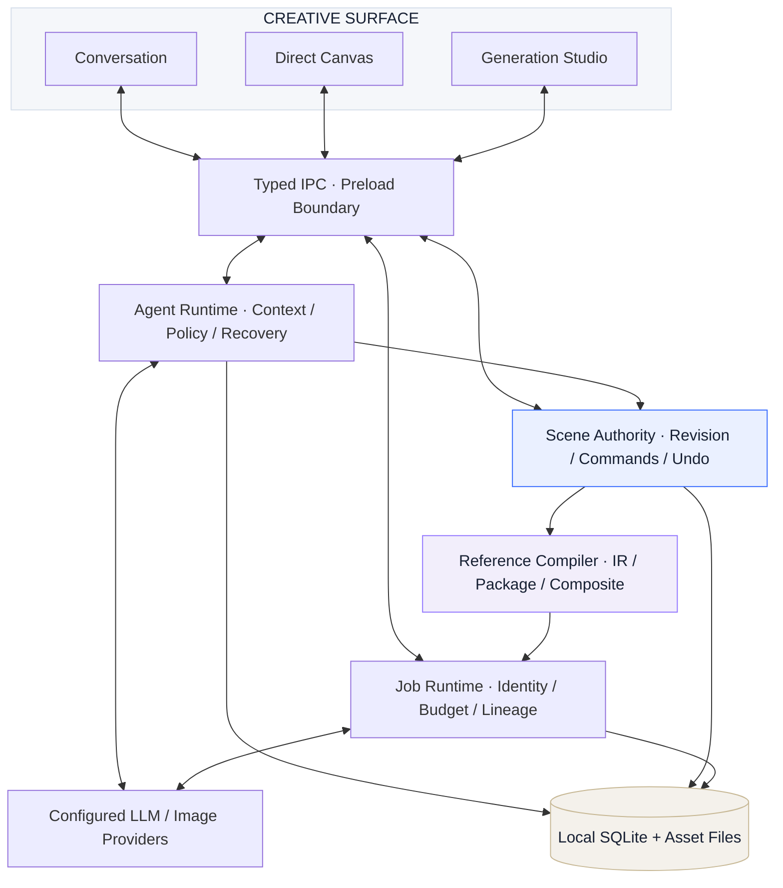

<div align="center">


# AI Canvas

**面向人机共创的结构化视觉运行时**

Natural language in. Editable scenes out. Your intent stays in control.

`Scene-native Agent` · `Reference Compiler` · `Revision-aware Execution` · `Local-first`

[创作体验](#创作体验) · [技术内核](#技术内核) · [系统架构](#系统架构) · [我们的愿景](#我们的愿景) · [快速开始](#快速开始)

</div>

## 从一句话，到一件可以继续修改的作品

**生成是一瞬间，创作是一连串决定。**

标题要再克制一点。主体往右。保留这束光。沿用刚才的构图，再试一个方向。

AI Canvas 把这些决定放进同一个可持续编辑的项目：自然语言表达意图，Agent 操作结构化 Scene，图像模型负责生成与编辑，你随时用鼠标接管最后一毫米。

**我们的核心命题：让画布成为 AI 的上下文，让 AI 成为画布的操作能力。**


<sub>实际应用截图，取自 2026-09-08 的离线场景验证；画面为自制合成测试素材，用于展示编辑能力，不作为真实模型画质示例。</sub>

## 创作体验

### 一个项目，三种创作焦点

| 对话 / Intent | 画布 / Composition | 生成 / Exploration |
|---|---|---|
| 表达目标、补充参考、指定保留项 | 直接调整文字、图片、形状和图层 | 编译参考、执行任务、比较与延续结果 |
| 观察 Agent 的实际动作与状态 | 选择、移动、缩放、分组、裁剪 | 将结果重新放回画布继续编辑 |

三种焦点围绕共享项目状态展开，连接 Scene、素材、选择与生成结果。你可以用语言开始，用画布修正，再让模型继续。

```text
“做一张 4:5 的香氛海报，标题是晨雾。先搭构图。”
     ↓
明确意图 → 结构化构图 → 人工精修 → 带参考生成 → 比较版本
                ↑                                ↓
                └──────── 继续编辑同一件作品 ────────┘
```

### 创作空间，跟着你的手走

工具栏、属性检查器与创作输入以 **Glass Islands** 组织：浮动、停靠、缩放、收起。界面将空间留给作品，同时保留桌面编辑所需的精确控制。

文字排版、结构参考与图像像素拥有各自的职责。画布上的文字和形状可以继续编辑；生成图片作为图片元素参与后续创作，不承诺把任意成图自动拆成独立图层。

<details>
<summary><strong>展开查看：封面创作与独立文字编辑</strong></summary>


同一批离线验证截图。底图与文字分开承载，排版调整保留在 Scene 中。

</details>

## 技术内核

### 01 / Scene-native Agent

**Agent 的动作，落在编辑器的数据模型里。**

画布由带 Schema 的元素构成：文字、图片、形状、草图、蒙版、光线与分组。Agent 通过受限工具创建和调整这些对象，用户也在操作同一份模型。

执行路径包含工具策略、作用域、元素锁定与 `expectedSceneRevision` 校验。模型依据旧画布提出的修改，可以在提交前被识别；画布实际执行的结果与模型文字描述分别记录。

`Typed Scene` → `Validated Tool Call` → `Command Batch` → `Committed Revision`

[Scene Schema](src/domain/scene/schema.ts) · [命令执行](src/domain/commands/apply-command.ts) · [Agent 执行器](src/main/agent/agent-tool-executor-shadow.ts)

### 02 / Visual Reference Compiler

**把构图意图编译成模型可以消费的约束。**

参考管线处理的不只有图片，还包括元素位置、遮挡、视觉权重、文字策略和参考角色。`Prompt IR` 保留中间语义，`Prompt Package` 组织请求上下文，Provider 编译层适配服务协议。

```text
Scene + Assets + Reference Policy
               │
               ▼
          Prompt IR
               │
               ▼
        Prompt Package  +  Composite Reference
               │
               ▼
      Provider-specific Request
```

支持 **Structure / Visual / Hybrid** 三种参考模式，把“借用布局”和“借用观感”变成明确的数据选择。

[Reference Compiler](src/main/reference/reference-compiler.ts) · [Prompt IR](src/main/reference/prompt-ir.ts) · [Provider 编译层](src/main/reference/provider-prompt-compiler.ts)

### 03 / Revision-aware, Reversible Operations

**一次修改有边界，也有来路。**

Scene revision、操作批次与持久化记录构成修改链路。Agent 的修改会形成可检查的批次；已提交的画布操作可以追溯和撤销。预期版本与实际版本分开核对，避免把并发发生的人工编辑当成不存在。

可撤销范围是应用支持的本地操作。已经发出的模型请求与产生的费用不会因为撤销画布而自动撤销。

[Scene Service](src/main/scene/scene-service.ts) · [执行与提交校验](src/main/agent/agent-tool-executor-shadow.ts)

### 04 / Stateful Agent Runtime

**创作上下文，跨越单次回答。**

Agent 运行时围绕 thread、turn、任务关系和执行状态组织创作；上下文构建与压缩连接近期对话、项目记忆、Directive 和当前 Scene。补充、修正与新的创作目标通过任务语义参与后续执行。

界面呈现动作、范围、结果、等待与恢复状态，不展示或伪造模型的私有思维链。

[Persistent Agent Loop](src/main/agent/persistent-agent-loop.ts) · [Context Builder](src/main/agent/context-builder.ts) · [任务契约](src/shared/agent-harness.ts)

### 05 / Cost-aware Generation Jobs

**把网络的不确定性，当作系统状态处理。**

生成任务保留请求身份、状态、结果与来源关联。请求数、图片数和费用上限参与执行策略；当请求可能已经发送而结果未知时，队列有禁止重复 POST 的处理路径。

这为取消、恢复、身份核对和结果回填提供了明确的位置。服务协议与真实响应仍决定哪些恢复能力可用。

[Generation Queue](src/main/generation/generation-queue.ts) · [生成工作流](src/main/generation/generation-workflow-coordinator.ts) · [执行策略](src/main/agent/generation-policy.ts)

### 06 / Local-first, Main-authoritative

**作品留在本机，外部能力经过明确边界。**

SQLite 与本地素材文件承载项目数据；Electron Main 管理持久化、凭据存取与模型请求。Renderer 通过 Preload 和窄 IPC 接口操作，窗口启用 sandbox、context isolation 并禁用 Node integration。

本地优先不等于所有模型都在本机运行。在线推理与生成会把相应提示词、参考内容发送给用户配置的 Provider。

[窗口隔离](src/main/window.ts) · [IPC 注册](src/main/ipc/register-desktop-ipc.ts) · [数据存储](src/main/storage/database.ts)

## 系统架构



| 层 | 技术选择 |
|---|---|
| Desktop Runtime | Electron · electron-vite · electron-builder |
| Typed UI & State | React · TypeScript · Zustand · Immer |
| Canvas & Interaction | Konva · react-konva · 浮动工具岛 |
| Contracts & Persistence | Zod · SQLite · better-sqlite3 · Kysely |
| Image Pipeline | Sharp · 参考合成 · 蒙版编译 |
| Verification | Vitest · Testing Library · Playwright |

## 我们的愿景

### 创作的单位，是持续演进的作品。

我们希望 AI 创作工具能够理解一件作品的连续性：哪些部分已经确定，哪些还在探索，哪些值得保留，以及你为什么要改下一步。

**AI Canvas 想成为一件可以每天使用的视觉创作仪器。**

- **让意图有结构。** 自然语言、参考图和手工编辑共同描述作品，减少反复解释。
- **让自动化可接管。** AI 能推进工作，你能随时检查、修改、撤销和继续。
- **让作品有记忆。** 连接素材、构图、生成与版本，让好的方向能够延续。
- **让工具有分寸。** 作品占据舞台，界面与自动化在需要时出现。

这是我们的长期方向。当前公开的是正在演进的产品实现；真实模型的理解、画质和编辑效果取决于服务能力，尚未完成的愿景不会写成已经交付的承诺。

**从“描述一张图”，走向“与 AI 一起完成一件作品”。**

## 快速开始

当前以 **Windows x64** 为主要开发与打包平台。准备 Node.js `>=22` 和 pnpm `11.9.0`，在项目根目录执行：

```powershell
pnpm install --frozen-lockfile
pnpm dev
```

打开应用，新建项目。在设置中分别配置语言模型与图片模型的协议、服务地址、模型标识和 API Key，并设置请求、图片与费用上限。本地画布可以先开始使用；在线能力使用你自己的模型服务与额度。

<details>
<summary><strong>Provider 协议与模型配置</strong></summary>

语言模型适配路径：Ark Responses、OpenAI Responses、OpenAI Chat Completions。

图片模型适配路径：Ark Seedream、OpenAI Images、任务式图片协议。

相同协议名称不保证所有服务实现都兼容。参考图、蒙版、编辑与流式输出还取决于具体服务的能力声明和实际响应。

配置定义见 [Provider Contracts](src/shared/provider-settings.ts)。仓库不提供可用密钥。

</details>

### 开发与测试

```powershell
pnpm typecheck
pnpm lint
pnpm test
pnpm test:integration
pnpm build
```

桌面交互测试使用 `pnpm test:e2e`；Windows 安装包与便携版使用 `pnpm package:win`。首次安装可能需要下载 Electron 和构建原生模块；桌面测试需要图形环境，部分专项用例需要额外的合成测试数据。

自动验证使用离线替身，不调用真实收费 Provider。macOS / Linux 尚未作为已验证的交付平台。当前代码状态不等于所有端到端场景都已重新验收。

### 仓库结构

```text
src/
  domain/       Scene schema、命令与领域逻辑
  main/         Agent、生成、参考编译、存储与安全边界
  preload/      桌面 API 桥接
  renderer/     React 界面、Konva 画布与交互状态
  shared/       跨进程类型与运行时契约
tests/          单元、集成与桌面行为测试及必要素材
build/          应用图标
assets/readme/  本页使用的公开展示素材
```

## Build with us

如果你正在探索 **AI 原生编辑器、可撤销的 Agent 执行、视觉语义编译或本地创作工具**，这里有一套可以直接阅读和运行的实现。

欢迎用一个真实的创作问题开始交流：想保留什么、希望改变什么、在哪一步失去了控制。提交反馈时使用脱敏截图与最小复现，不附带私人项目或凭据。

当前尚未配置开源许可证，复用授权范围待明确。

<div align="center">

**The canvas is the context. The next move is yours.**

如果这也是你想看到的创作未来，留一颗 Star，一起把它做出来。

</div>
